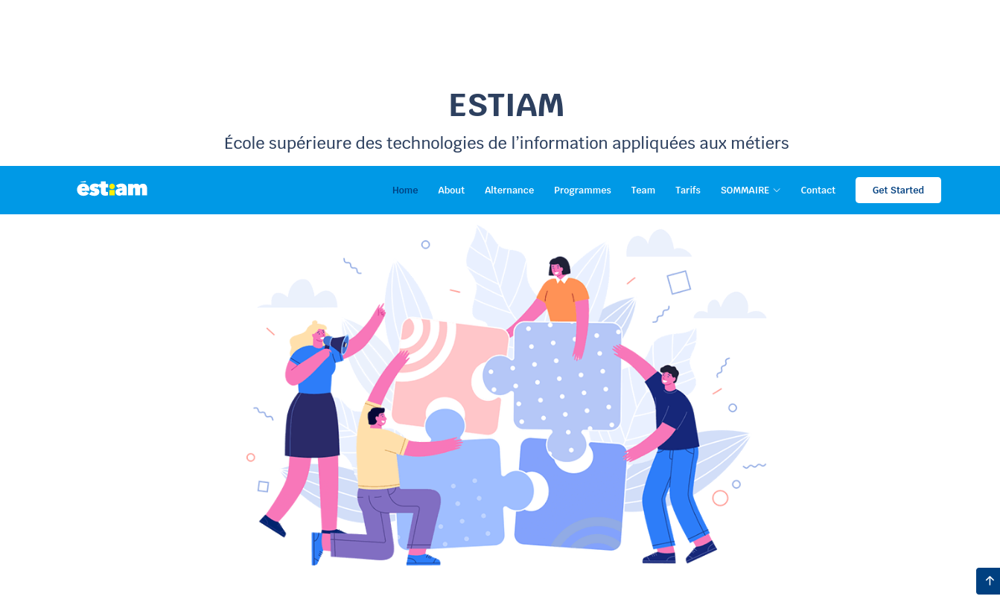

# Projet Plaquette 

## Membres

	Yasmine Nafissa LACHACHI

	Cynthia RABEMANANTSOA

	Elie DECHASSE

	Sadio TOURE

	Togni KIKI

	Viverk Ange ANTHONIPPILLAI

	Manuel DASSI KUETI

## Fonctionnalités rendus

#### ! Back-end :

	-Gestion des administrateurs et des gestionnaires de la plateforme
	-Gestion du contenu des programmes par thème (Soft Skills, Cloud &
		Cyber Security, Apps & Design, Data, Internet of things, Hackathons, Professional
		Expérience et Integration Project)
	-Gestion du contenu des entreprises et campus partenaires (international)
	-Gestion du contenu des certifications professionnelles préparées
	-Gestion du contenu de la page des finances
	-Gestion des blocs de compétences
	-Gestion des rôles utilisateur

#### !Front-end :
	- Lien redirigeant vers le dossier d’admission
	- Formulaire de contact permettant d’enregistrer les prospects
	- Interfaces contenant les programmes par année, par thème ainsi que les compétences acquises pour chaque année
	- Interface contenant les informations liées à l’alternance
	- Interface contenant les éléments pour financer la formation
	- Interface contenant les certifications préparées
	- Interface contenant les entreprises partenaires de l’Estiam
	- Interface contenant les campus partenaires de l’Estiam

## Bonus 

	- Online Website
	- Gestion des session Login Logout$
	- Base de données sécurisée

## Requirements

- [x] Mongo execute Prompt / Bash
- [x] Node JS Installed
- [x] Python
- [x] mongod --port 27017 --dbpath /path

## Installation

    
    git clone https://github.com/cnini/projet_plaquette.git
    cd projet_plaquette
    npm install
    nodemon index
    

## Good practice

* Please create your `*.env` and source files in an appropriate directory
(it may already exist)
* Always make your path is relative to root directory and thus run `landslide`
from it
* If applicable, update `index.js` with the link to you new slides

!!  Next, just run:

	  dashboard
    
       
## Publishing

Presentation are served under http://https://projet-g6.life-cm.com//

## Structure

    ├── node            --> symbolic link to module
    ├── publics         --> Github delivery root
    │   ├── img         --> Assets directory
    │   ├── assets      --> Assets directory
    │   │   └── theme   --> landslide theme root
    │   │       ├── js
    │   │       └── css
    │   ├── index.ejs   --> home page, not generated
    │   └── *.html      --> presentation files
    └── *               --> any other directory containing *.env files

## 🛠️ Our favorite tools

### 👨‍💻 Programming languages

    
    
    
    
    

### 🧰 Frameworks and libraries

	
    
    

### 🗄️ Databases and cloud hosting

    
    

 

## Notes

https://www.estiam.education/charte-graphique/
